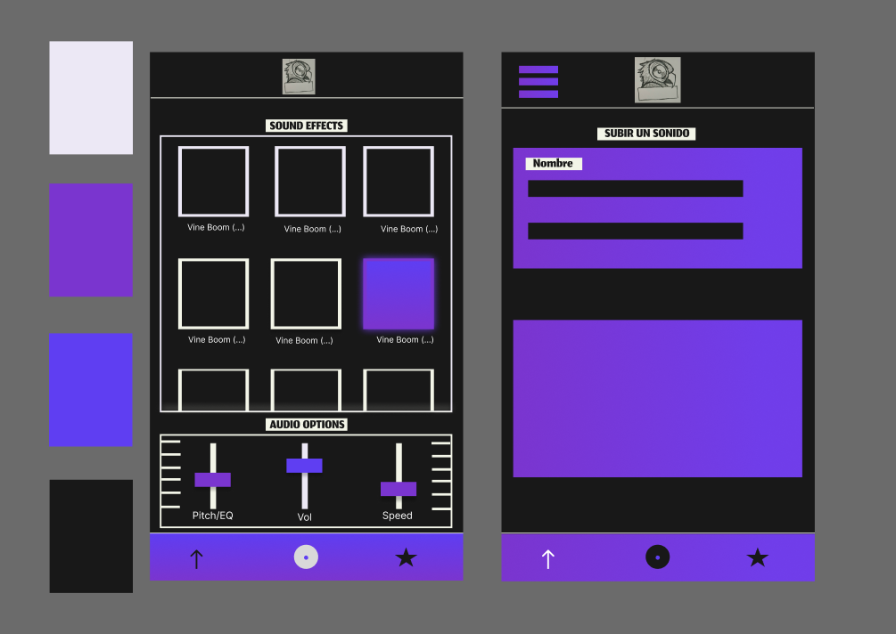

# Diseño 

Las funciones que debe incluir la app son:
- Mostrar los efectos de sonido.
- Reproducir los efectos de sonido.
- Porder modificar la velocidad y el volumen de los efectos de sonido.
- Subir y borrar categorías y sonido.
- Filtrar por categorías.

## Navegación 

#### Mockup inicial del diseño de la app

#### Logo de la app

